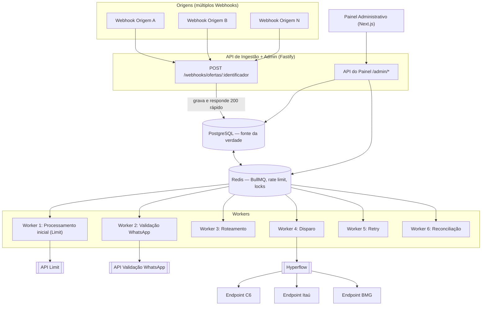
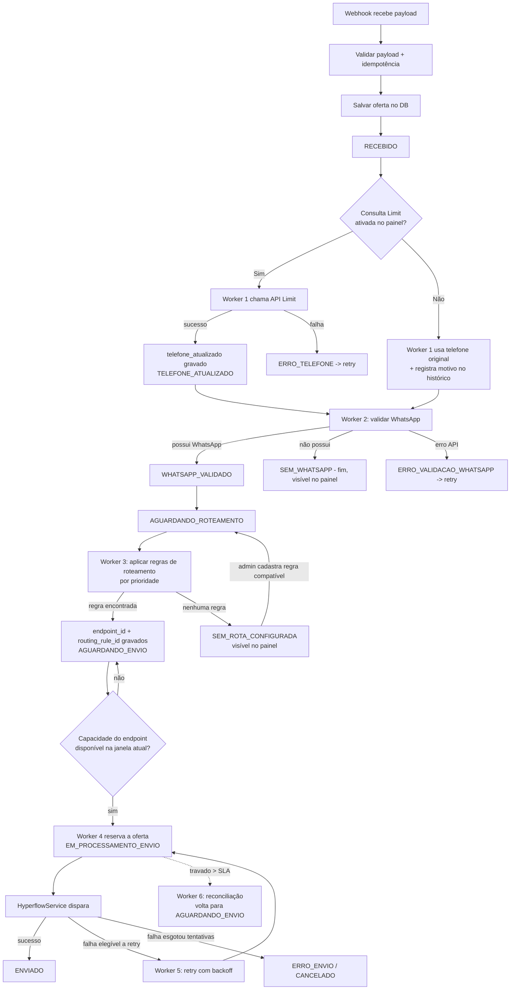
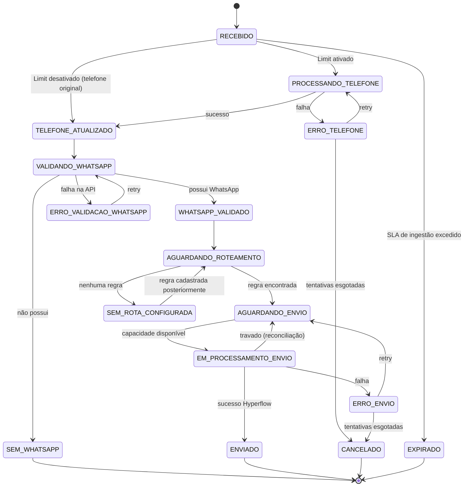
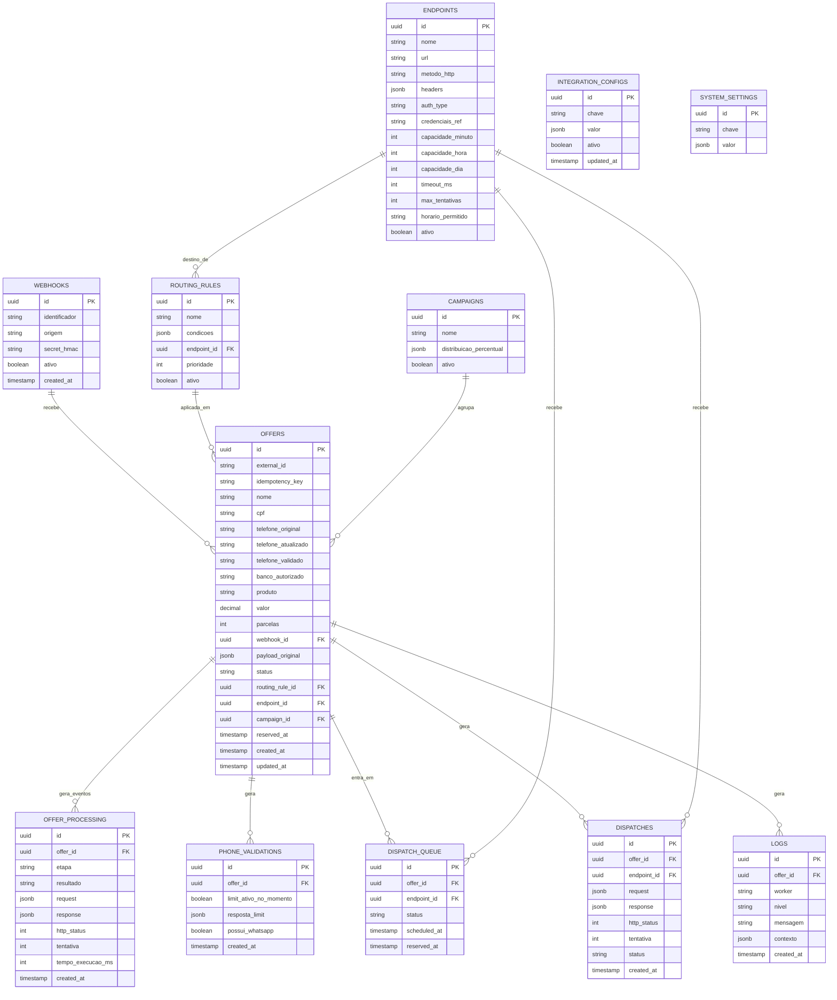

# Plataforma de Gestão, Validação, Roteamento e Disparo de Ofertas
## Documento de Arquitetura — v1.0 (14/08/2026)

> Documento de trabalho para implementação. Cobre os entregáveis pedidos no escopo original (item 48) antes de iniciar o código: arquitetura, fluxograma, máquina de estados, modelo de dados, estratégias de fila/concorrência/rate limiting/retry/roteamento, estrutura do painel, segurança/LGPD, observabilidade, estrutura de pastas, stack e plano de fases.

---

## 0. Objetivo e princípios não-negociáveis

A plataforma é um **motor de processamento e roteamento de ofertas**, não um CRUD. Princípios que guiam todas as decisões abaixo:

1. O banco de dados é a única fonte de verdade do estado da oferta. Nenhuma API externa decide o estado sozinha.
2. O recebimento (webhook) nunca depende de integrações externas — é síncrono apenas até salvar no banco; todo o resto é assíncrono.
3. Nenhuma falha externa pode causar perda de oferta. Tudo que falha vai para retry ou para um estado de exceção visível no painel — nunca é descartado silenciosamente.
4. A API Limit é uma etapa **opcional e configurável em runtime**, sem redeploy.
5. Toda oferta é rastreável de ponta a ponta (timeline completa).
6. Nenhuma oferta pode ficar presa indefinidamente em um estado (mecanismo de reconciliação).

---

## 1. Stack tecnológica recomendada

| Camada | Escolha | Motivo |
|---|---|---|
| Linguagem/runtime | Node.js 20+ com TypeScript | Pipeline é fortemente I/O-bound (webhooks, chamadas a 3 APIs externas). O event loop não-bloqueante do Node é adequado, e TypeScript compartilhado entre API, workers e painel evita duplicar contratos (enums de estado, schema da oferta) — importante para um único desenvolvedor mantendo o sistema todo. |
| API de ingestão/admin | Fastify | Overhead mínimo por request, schema validation nativa (JSON Schema) para validar payloads de webhook rapidamente antes de responder 200 OK. |
| Banco de dados | PostgreSQL 15+ | Transacional, suporta `SELECT ... FOR UPDATE SKIP LOCKED` nativamente — resolve o requisito de concorrência (item 25) sem depender de lock distribuído para o caso comum. Índices parciais e JSONB cobrem bem payloads variáveis. |
| ORM/migrations | Prisma | Migrations versionadas, type-safety ponta a ponta, mapeia bem no modelo ER da seção 5. |
| Filas / workers | BullMQ sobre Redis | Cobre praticamente 1:1 os requisitos dos itens 20–28: fila **por endpoint**, `limiter` nativo por fila (rate limiting), `concurrency` configurável por worker, retries com backoff exponencial configurável, delayed jobs, jobs travados voltam automaticamente (stalled job recovery) — evita reinventar essa infraestrutura. |
| Cache / locks / rate limit | Redis (o mesmo do BullMQ) | Reaproveitado para contadores atômicos de capacidade (`INCR` com TTL por janela de tempo) e locks distribuídos quando necessário além do que o Postgres cobre. |
| Painel administrativo | Next.js (React) + mesmo backend Fastify (API admin) | Mesma linguagem/stack do backend, SSR simples para dashboards, fácil deploy junto do resto. |
| Logs estruturados | Pino | Log JSON estruturado, baixo overhead, integra fácil com qualquer stack de observabilidade. |
| Métricas/observabilidade | Prometheus + Grafana (ou OpenTelemetry) | Métricas de fila, latência de API externa, taxa de erro — ver seção 15. |
| Containerização | Docker + Docker Compose | Isolamento de API, workers e painel; facilita escalar workers horizontalmente depois. |

**Alternativa considerada e descartada:** Python (FastAPI + Celery) — também resolveria o problema, mas Celery exige mais configuração manual para "rate limit por fila = capacidade por endpoint" e para retry granular por status HTTP, enquanto BullMQ oferece isso de forma mais direta. Como a stack é única para API + workers + painel, ficar em uma linguagem só (TypeScript) reduz a carga cognitiva de manter tudo sozinho.

---

## 2. Arquitetura geral (componentes)



Pontos-chave:

- O webhook só grava no Postgres e devolve 200 — não chama Limit, WhatsApp, roteamento ou Hyperflow de forma síncrona (item 46).
- Todos os workers leem configuração dinâmica (Limit ativo/inativo, capacidade de endpoint, regras ativas) direto do banco/Redis a cada ciclo — nunca de variável de ambiente ou constante em código (item 27).
- O painel administrativo fala com o mesmo banco e Redis, nunca direto com as APIs externas.

---

## 3. Fluxograma completo do pipeline



---

## 4. Máquina de estados

Estados normais: `RECEBIDO → PROCESSANDO_TELEFONE → TELEFONE_ATUALIZADO → VALIDANDO_WHATSAPP → WHATSAPP_VALIDADO → AGUARDANDO_ROTEAMENTO → AGUARDANDO_ENVIO → EM_PROCESSAMENTO_ENVIO → ENVIADO`.

Estados de exceção: `SEM_WHATSAPP`, `SEM_ROTA_CONFIGURADA`, `ERRO_TELEFONE`, `ERRO_VALIDACAO_WHATSAPP`, `ERRO_ENVIO`, `CANCELADO`, `EXPIRADO`.



Regra de ouro: **todo worker que move uma oferta para um estado "EM_PROCESSAMENTO_*" grava também `reserved_at`**. O Worker 6 (reconciliação) varre periodicamente ofertas com `reserved_at` mais antigo que um SLA configurável e as devolve ao estado anterior, evitando que fiquem presas.

---

## 5. Modelo de dados / Diagrama ER



Notas importantes:

- `telefone_original`, `telefone_atualizado` e `telefone_validado` são campos **separados** (item 11) — nunca sobrescrever de forma irreversível.
- `payload_original` guarda o JSON bruto recebido no webhook, sem transformação.
- `idempotency_key` = `external_id` quando disponível, senão um hash determinístico de (`webhook_id` + campos-chave do payload). Constraint `UNIQUE(webhook_id, idempotency_key)`.
- `routing_rule_id` e `endpoint_id` ficam gravados na própria oferta **e** duplicados em `OFFER_PROCESSING`/log de roteamento, para que o histórico sobreviva mesmo se a regra for alterada depois (item 30).

**Índices recomendados** (conforme item 39): `offers(status)`, `offers(created_at)`, `offers(updated_at)`, `offers(webhook_id)`, `offers(endpoint_id)`, `offers(routing_rule_id)`, `offers(cpf)`, `offers(telefone_validado)`, `offers(reserved_at)` (parcial, `WHERE status LIKE 'EM_PROCESSAMENTO%'`), `dispatch_queue(endpoint_id, status)`, `offer_processing(offer_id, created_at)`.

---

## 6. Workers, filas e concorrência

### 6.1 Os seis workers (item 26)

| Worker | Função | Fonte | Ação |
|---|---|---|---|
| 1 — Processamento inicial | Verifica config do Limit; consulta Limit ou usa telefone original | Ofertas em `RECEBIDO` | Atualiza telefone, avança estado |
| 2 — Validação WhatsApp | Chama API de validação | Ofertas com telefone definido | Marca `WHATSAPP_VALIDADO` / `SEM_WHATSAPP` |
| 3 — Roteamento | Aplica regras por prioridade | Ofertas `AGUARDANDO_ROTEAMENTO` | Define `endpoint_id` / `routing_rule_id` ou `SEM_ROTA_CONFIGURADA` |
| 4 — Disparo | Verifica capacidade e dispara via Hyperflow | Ofertas `AGUARDANDO_ENVIO` | Reserva, dispara, atualiza status |
| 5 — Retry | Reprocessa falhas elegíveis | Ofertas em estados `ERRO_*` com tentativas restantes | Reenvia ao worker correspondente |
| 6 — Reconciliação | Detecta ofertas presas (`reserved_at` antigo) | Ofertas em `EM_PROCESSAMENTO_*` | Devolve ao estado anterior para reprocessamento |

### 6.2 Fila por endpoint (item 22)

Cada endpoint ativo tem sua própria fila BullMQ (`dispatch:{endpoint_id}`), criada/atualizada dinamicamente conforme os endpoints cadastrados no painel. A oferta só entra na fila de disparo depois que `endpoint_id` já está definido.

### 6.3 Concorrência (item 25)

Duas camadas complementares:

1. **Reserva atômica no Postgres**: o worker busca candidatas com
   `SELECT ... FOR UPDATE SKIP LOCKED WHERE status = 'AGUARDANDO_ENVIO' AND endpoint_id = $1 LIMIT $batch`
   dentro de uma transação que já marca `status = 'EM_PROCESSAMENTO_ENVIO'` e `reserved_at = now()`. Isso garante que dois workers nunca peguem a mesma oferta.
2. **Controle de capacidade via Redis**: um contador atômico por endpoint e por janela (`INCR endpoint:{id}:hora:{yyyyMMddHH}` com `EXPIRE`) evita depender só do Postgres sob alto volume — o worker só chama `INCR` e segue se o resultado for ≤ capacidade configurada; senão, devolve o job para a fila com delay.

### 6.4 Rate limiting por endpoint (item 21)

BullMQ permite configurar `limiter: { max, duration }` por fila — mapeando diretamente "capacidade por hora" do endpoint. Endpoints com capacidade por minuto/dia usam o contador Redis da seção 6.3 como camada adicional (BullMQ limita vazão instantânea; o contador garante o teto absoluto por hora/dia mesmo reiniciando o processo).

### 6.5 Retry (item 28)

Cada integração externa (Limit, WhatsApp, Hyperflow) tem política própria, configurável no painel:

- Máximo de tentativas (ex.: 5)
- Backoff exponencial com jitter (ex.: 30s, 1min, 5min, 15min, 1h)
- Lista de status HTTP retryable (5xx, 429, timeout) x não-retryable (4xx exceto 429)
- Timeout por chamada

Retry nunca é infinito — ao esgotar tentativas, a oferta vai para um estado terminal de erro, visível e reprocessável manualmente no painel.

---

## 7. Motor de roteamento e endpoints

### 7.1 Regras de roteamento (itens 15–17)

`routing_rules.condicoes` é um JSON de condições (`banco_autorizado`, `origem`/`webhook_id`, `produto`, etc.) avaliadas em memória pelo Worker 3, ordenadas por `prioridade` ascendente (1 = mais específica). A primeira regra ativa cujas condições casam com a oferta é aplicada. Sem match → `SEM_ROTA_CONFIGURADA`, oferta permanece visível no painel e retorna ao fluxo automaticamente quando uma regra compatível é cadastrada/ativada (reprocessada pelo próprio Worker 3 no próximo ciclo).

### 7.2 Endpoints de disparo (itens 18–20)

Cada endpoint é uma entidade própria com URL, autenticação, headers, capacidade (minuto/hora/dia), timeout, tentativas máximas, prioridade e horário permitido — nunca um "link" solto. Credenciais ficam referenciadas (`credenciais_ref`) e resolvidas em runtime via secret manager/variáveis de ambiente do servidor, nunca no banco em texto puro nem no frontend.

### 7.3 HyperflowService (item 23)

Toda a lógica de integração com a Hyperflow (autenticação, montagem de payload, headers, timeout, retry, logs) fica encapsulada em um único serviço (`packages/integrations/hyperflow`), nunca espalhada pela aplicação. Os workers chamam apenas `hyperflowService.dispatch(offer, endpoint)`.

---

## 8. Painel administrativo

Telas mínimas (itens 31–38):

- **Dashboard geral**: totais por etapa do funil (recebido, telefone atualizado, validado, com/sem WhatsApp, aguardando roteamento/envio, enviado, erro, retry).
- **Integrações / Validação de telefone**: toggle ATIVADO/DESATIVADO da API Limit, com data da última execução, processados e erros — alteração é dinâmica (lida do banco pelo Worker 1 a cada ciclo, sem restart).
- **Endpoints de Disparo**: CRUD completo (seção 7.2) + dashboard por endpoint (capacidade, volume usado/restante, fila pendente, enviados, falhas, retries, taxa de sucesso, latência, histórico).
- **Regras de Roteamento**: CRUD com prioridade e preview de quais ofertas `SEM_ROTA_CONFIGURADA` passariam a casar.
- **Dashboard por Webhook**: recebido, processado, com/sem WhatsApp, roteado/sem rota, disparado, erros, volume por período.
- **Dashboard por banco autorizado**: mesmas métricas agrupadas por `banco_autorizado`.
- **Oferta individual**: timeline completa (todos os eventos de `OFFER_PROCESSING` + `LOGS` em ordem cronológica), incluindo o motivo quando o Limit foi ignorado.

---

## 9. Segurança e LGPD

**Segurança (item 41):** HTTPS obrigatório; autenticação de webhook por assinatura HMAC (`secret_hmac` por origem) validada antes de qualquer processamento; API keys/JWT para o painel administrativo com RBAC (admin vs. leitura); segredos fora do código (variáveis de ambiente / secret manager, nunca em `INTEGRATION_CONFIGS` em texto puro); validação de payload via JSON Schema no Fastify; proteção contra SQL injection (Prisma parametrizado por padrão); proteção contra replay (janela de validade do HMAC + idempotência); auditoria de alterações no painel (quem alterou Limit/endpoint/regra e quando).

**LGPD (item 41):** o sistema trata dado pessoal sensível (CPF, telefone, dados financeiros). Medidas: minimização (só armazenar o necessário do payload), mascaramento de CPF/telefone em logs (`LOGS.contexto` e `OFFER_PROCESSING.request/response` nunca gravam CPF completo — usar `***.***.***-XX`), criptografia em repouso para colunas sensíveis (`pgcrypto` ou criptografia de aplicação), controle de acesso por papel no painel, política de retenção/expurgo de dados antigos, e trilha de auditoria para atender a eventuais solicitações de titular de dados (acesso/exclusão).

---

## 10. Observabilidade (item 42)

Métricas mínimas: ofertas/minuto e /hora (geral e por webhook/banco/endpoint); latência de cada API externa; taxa de erro e de retry por integração; taxa de "possui WhatsApp"; taxa de envio; capacidade utilizada vs. disponível por endpoint; ofertas sem rota; ofertas presas em processamento (alertável — se esse número subir, o Worker 6 está falhando). Logs estruturados (Pino) correlacionados por `offer_id` para permitir reconstruir a timeline sem consultar o banco. Alertas (ex.: via Grafana) para: fila de um endpoint crescendo sem vazão, taxa de erro de uma integração acima do normal, ofertas `SEM_ROTA_CONFIGURADA` acumulando.

---

## 11. Estrutura de pastas proposta

```
/apps
  /api            -> Fastify: webhooks + API do painel
  /workers        -> 6 processos (um entrypoint por worker, mesma base de código)
  /admin-panel    -> Next.js (frontend do painel)
/packages
  /domain         -> tipos, enums de estado, entidades compartilhadas
  /database       -> schema Prisma, migrations, repositórios
  /queue          -> configuração BullMQ, definição das filas/jobs
  /integrations
    /limit
    /whatsapp
    /hyperflow
  /shared         -> logger (Pino), config dinâmica, utils
/infra
  docker-compose.yml
  Dockerfile.api
  Dockerfile.worker
  Dockerfile.admin-panel
```

---

## 12. Plano de desenvolvimento por fases

1. **Fase 0 — Base**: repo, Docker Compose (Postgres + Redis), schema inicial (Prisma), CI básico.
2. **Fase 1 — Ingestão**: webhook, idempotência, `payload_original`, máquina de estados inicial (`RECEBIDO`).
3. **Fase 2 — Limit configurável**: Worker 1, toggle no painel (endpoint admin simples), fallback para telefone original, histórico de "ignorado".
4. **Fase 3 — Validação WhatsApp**: Worker 2 + integração externa.
5. **Fase 4 — Roteamento**: `routing_rules`, `endpoints`, Worker 3, tratamento de `SEM_ROTA_CONFIGURADA`.
6. **Fase 5 — Disparo**: fila por endpoint, rate limiting/capacidade, Worker 4, `HyperflowService`.
7. **Fase 6 — Resiliência**: Worker 5 (retry) e Worker 6 (reconciliação).
8. **Fase 7 — Painel completo**: dashboards (geral, por endpoint, por webhook, por banco, timeline por oferta).
9. **Fase 8 — Segurança/LGPD/Observabilidade**: HMAC, RBAC, mascaramento de logs, métricas, alertas.
10. **Fase 9 — Carga e produção**: testes de carga simulando múltiplos webhooks e endpoints, ajuste fino de capacidade/concorrência, deploy.
11. **Fase 10 (futuro, fora do MVP)**: distribuição percentual entre endpoints/A-B testing (item 45), múltiplos canais (SMS/e-mail), múltiplos provedores de WhatsApp — o modelo de dados já não impede essa evolução (`campaigns.distribuicao_percentual` já reservado).

---

## 13. Riscos e possíveis gargalos

- **Disparo duplicado sob concorrência**: mitigado por `SELECT FOR UPDATE SKIP LOCKED` + constraint de unicidade (uma oferta não pode ter dois registros `EM_PROCESSAMENTO_ENVIO` simultâneos); precisa de teste de carga dedicado antes de ir a produção.
- **Contagem de capacidade dessincronizada entre instâncias**: por isso o contador de capacidade vive no Redis (compartilhado), não em memória de cada worker.
- **APIs externas instáveis (Limit, WhatsApp, Hyperflow)**: sem circuit breaker, retries podem se acumular e mascarar uma indisponibilidade prolongada como "lentidão" — recomenda-se circuit breaker simples (ex.: `opossum`) por integração.
- **Crescimento de `logs`/`offer_processing`**: em alto volume isso cresce rápido; prever particionamento por data ou política de retenção desde o início.
- **Regras de roteamento ambíguas**: duas regras com a mesma prioridade e condições que casam com a mesma oferta geram comportamento não-determinístico — validar unicidade de prioridade no cadastro.
- **Config "hot-reload"**: como Limit/capacidade/regras são alteráveis sem redeploy, os workers precisam reconsultar essas configs a cada ciclo (ou via pub/sub Redis) — nunca cachear em memória por muito tempo sem invalidação.
- **Exposição de dados pessoais em logs**: mascarar CPF/telefone é fácil de esquecer em algum ponto do código; vale um teste automatizado que falha se um log contiver um CPF em formato completo.

---

*Próximo passo sugerido após validação deste documento: iniciar a Fase 0 (setup de repositório e infraestrutura) e a Fase 1 (ingestão via webhook).*
